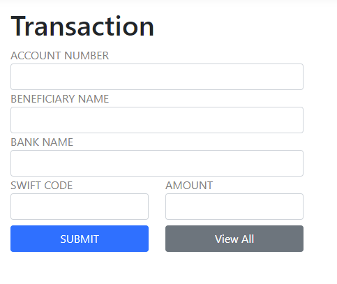
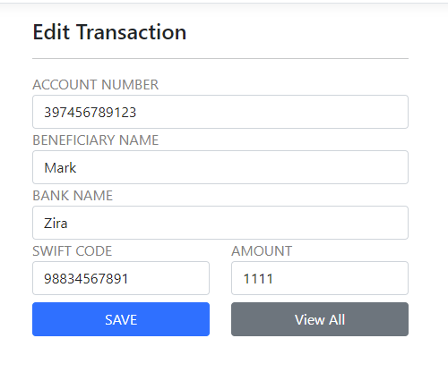

# BankTransactions

- .NET 6 MVC CRUD app with EF Core

## Technologies used
- Frontend: Bootstrap
- EF Core with SQL Server

## How it looks
- All Transactions {height=100px width=100px}
- Add Transaction {height=100px width=100px}
- Edit Transaction {height=100px width=100px}
